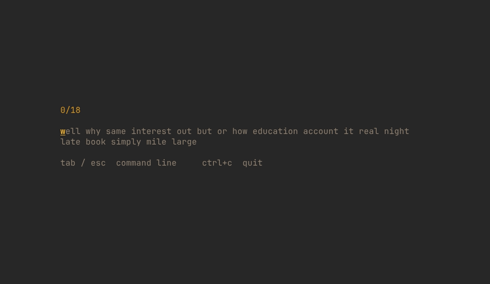

<div align="center">

# monkeytui

**A minimalist [monkeytype](https://monkeytype.com)-style typing test for your terminal.**

Written in Go with [Bubble Tea](https://github.com/charmbracelet/bubbletea) · adapts to your terminal's color theme.



[](LICENSE)
[](https://go.dev)
[](https://github.com/ricardojparram/monkeytui/releases)

</div>

---

## Features

- **Three test modes** — `time` (15/30/60/120s), `words` (10/25/50/100), and `quote`.
- **Live feedback** — per-character coloring, a smooth blinking caret, mistakes in red.
- **Rich results** — a braille WPM/raw graph (with error markers), accuracy, raw WPM,
  consistency, a character breakdown, and a colored replay of what you typed.
- **Command palette** — monkeytype-style: hit `Tab`/`Esc` to switch mode, time, word
  count or accent theme without touching the mouse.
- **Theme-adaptive** — all colors come from your terminal's own ANSI palette, so it
  looks at home in gruvbox, nord, dracula, solarized, or whatever you run.

## Install

No Go toolchain required — the script downloads a prebuilt binary for your platform:

```sh
curl -fsSL https://raw.githubusercontent.com/ricardojparram/monkeytui/main/install.sh | bash
```

<details>
<summary>Other ways to install</summary>

**With Go:**

```sh
go install github.com/ricardojparram/monkeytui@latest
```

**Manual download:** grab a binary from the [latest release](https://github.com/ricardojparram/monkeytui/releases/latest),
`chmod +x` it, and move it onto your `PATH`. Verify with `sha256sum -c checksums.txt`.

| OS | Arch | Asset |
|----|------|-------|
| Linux | x86_64 | `monkeytui_linux_amd64` |
| Linux | arm64 | `monkeytui_linux_arm64` |
| macOS | Intel | `monkeytui_darwin_amd64` |
| macOS | Apple Silicon | `monkeytui_darwin_arm64` |
| Windows | x86_64 | `monkeytui_windows_amd64.exe` |

</details>

### Update / uninstall

```sh
monkeytui update      # download and install the latest release
monkeytui uninstall   # remove the installed binary
monkeytui version     # print the installed version
```

## Usage

```sh
monkeytui                          # default: 30s time mode, yellow accent
monkeytui -mode words -words 50
monkeytui -mode quote
monkeytui -mode time -time 60 -theme cyan
monkeytui -seed 42                 # reproducible word sequence
```

| Flag | Default | Description |
|------|---------|-------------|
| `-mode`  | `time`   | `time`, `words`, or `quote` |
| `-time`  | `30`     | seconds, for time mode |
| `-words` | `25`     | word count, for words mode |
| `-theme` | `yellow` | accent: `yellow green cyan magenta blue red` |
| `-seed`  | `0`      | fixed RNG seed (0 = random) |

## Keys

| Key | Action |
|-----|--------|
| any letter | type |
| `Space` | next word |
| `Backspace` | delete (steps into the previous word) |
| `Tab` / `Esc` | open the command palette |
| `Enter` (on results) | next test |
| `Ctrl+C` | quit |

In the command palette: type to filter, `↑`/`↓` to move, `Enter` to apply, `Esc` to close.

## Building from source

```sh
git clone https://github.com/ricardojparram/monkeytui
cd monkeytui
go build -o monkeytui .
go test ./...
```

The demo GIF is generated from [`demo.tape`](demo.tape) with
[VHS](https://github.com/charmbracelet/vhs): `vhs demo.tape`.

## Contributing

Contributions are welcome — see [CONTRIBUTING.md](CONTRIBUTING.md) for the workflow,
project layout, and conventions.

## Credits

Inspired by **[monkeytype](https://monkeytype.com)** by Miodec and contributors — the
typing test that set the bar for feel and presentation. monkeytui is an independent
reimplementation for the terminal and reproduces the *experience*, not the code.

Built on the wonderful [Charm](https://charm.sh) libraries — Bubble Tea and Lip Gloss —
and [ntcharts](https://github.com/NimbleMarkets/ntcharts) for the results graph.

## License & attribution

monkeytui is licensed under the [MIT License](LICENSE).

- This project contains **no monkeytype source code**. It is an original Go
  implementation; monkeytype itself is licensed GPL-3.0 and none of it is copied,
  linked, or distributed here.
- The bundled word list is a hand-authored set of common English words (word
  frequency is factual and not copyrightable). The quotes are short, attributed
  quotations.
- "monkeytype" is the name of that separate project. monkeytui is **not affiliated
  with, endorsed by, or connected to** monkeytype; the name is a nod, used in the
  nominative sense ("a monkeytype-style test").
